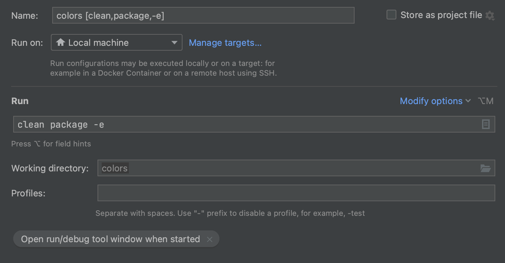
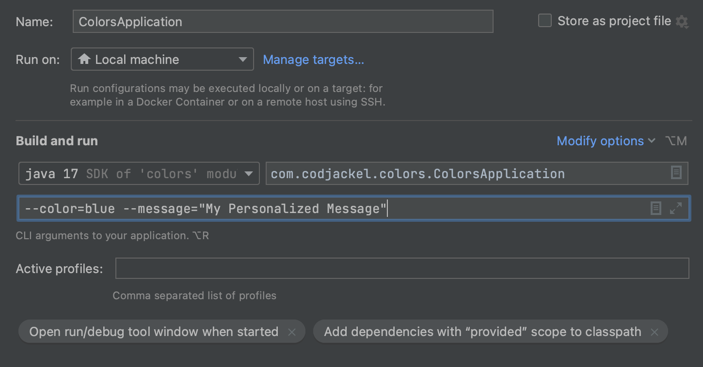
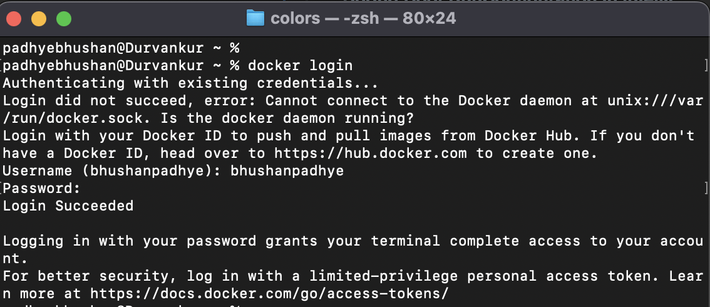
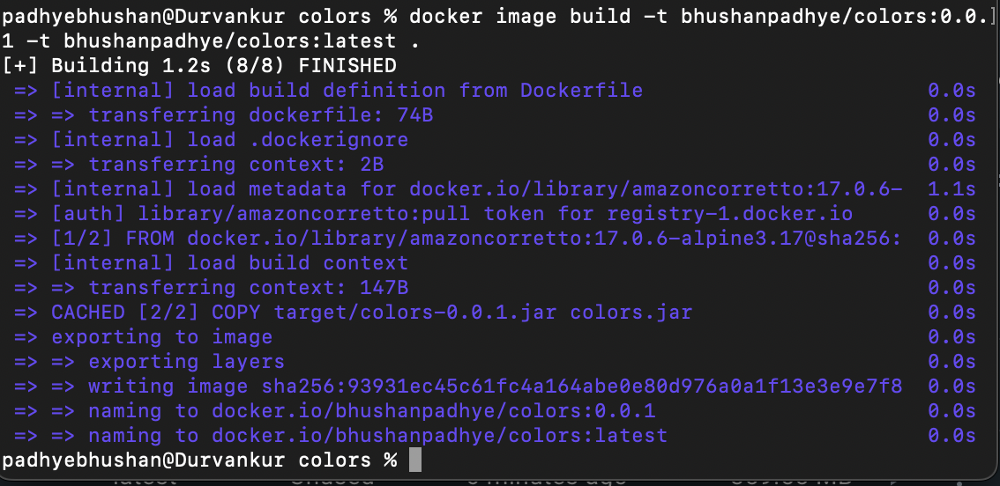
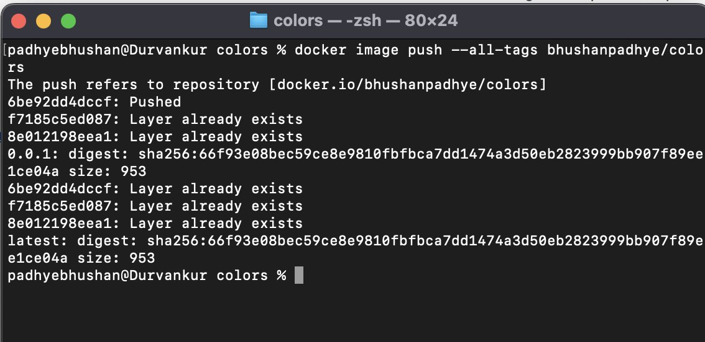

<h1 align="center">Series of sample application for K8s practice</h1>
<h2 align="center">Colors</h2>

  
   
  <i>This application is meant for practicing basic kubernetes objects like pod, replicaSet etc.
      using Java 17, Spring Boot 3 and Angular 15.</i>
   

## Documentation

Get started with build, run and build docker images.

- [Required Software](#required-software)
- [Maven Build And Package](#maven-build-and-package)
- [Spring Boot Run](#spring-boot-run)
- [Docker Build and Push to repository](#docker-build-and-push-to-repository)
- [Accessing Web Application](#accessing-web-application)

### Required Software
- Java 17
- Maven
- Node 18
- Angular Cli 15
- Npm 8
- Docker(Optional)

### Maven Build and Package

<h5 style="text-decoration: underline">Running Maven Build</h5>

Below command line can be used in project root to perform maven build.
<pre><code>mvn clean install -e</code></pre>

<h5 style="text-decoration: underline">Maven Build Configuration in intellij</h5>

Below command line can be used in project root to perform maven package.
<pre><code>mvn clean package -e</code></pre>

<h5 style="text-decoration: underline">Maven Package Configuration in intellij</h5>

### Spring Boot Run

Below command line can be used in project root to run spring boot application.
<pre><code>java -jar target/colors-{version}.jar com.codejackel.colors.ColorsApplication</code></pre>

Below command line can be used in project root to run spring boot application.
**<i>Passing program arguments of color and message</i>
<pre><code>java -jar target/colors-{version}.jar com.codejackel.colors.ColorsApplication --color=blue --message="My Personalized Message"</code></pre>

<h5 style="text-decoration: underline">Spring Boot RunConfiguration in intellij</h5>

### Docker Build and Push to repository

1. Login to Docker
<pre><code>docker login</code></pre>

2. Run docker build command in project root to generate image tag
<pre><code>docker image build -t {hub-user-name}/colors:0.0.1 -t bhushanpadhye/colors:latest .</code></pre>

3. Push docker image
<pre><code>docker image push --all-tags {hub-user-name}/color</code></pre>

### Accessing web application

[Web Application URL](http://localhost:8080)

Curl Command:
<pre><code>curl --location --request GET 'http://localhost:8080/api/v1'</code></pre>

